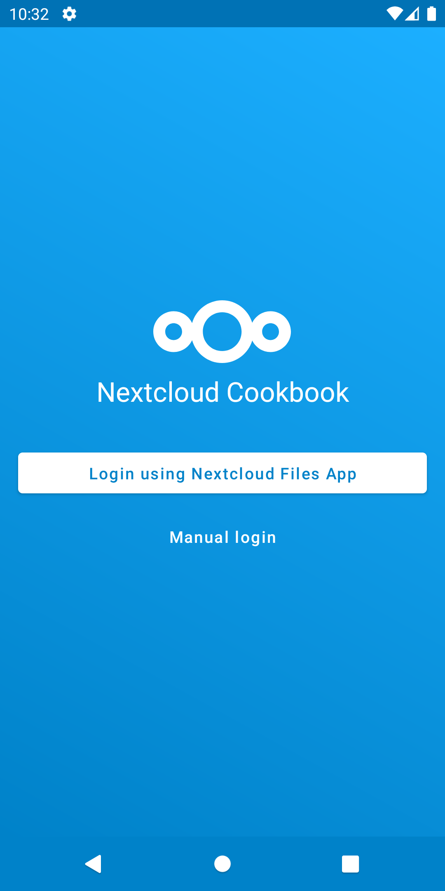
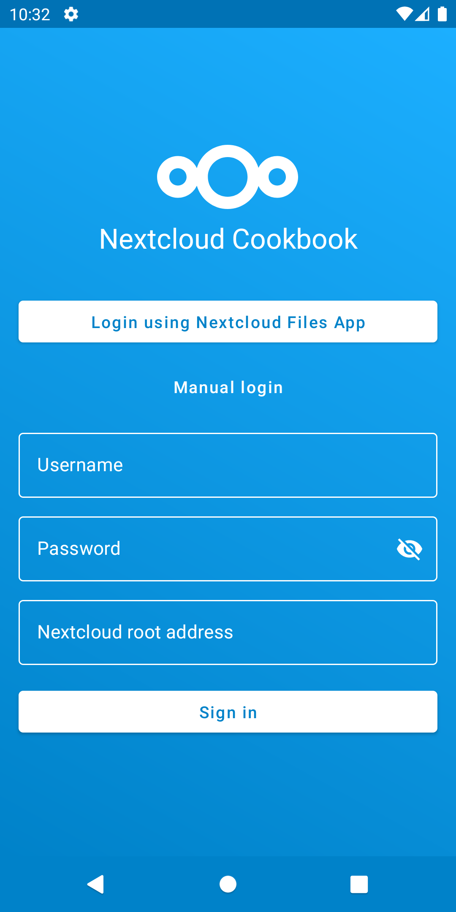
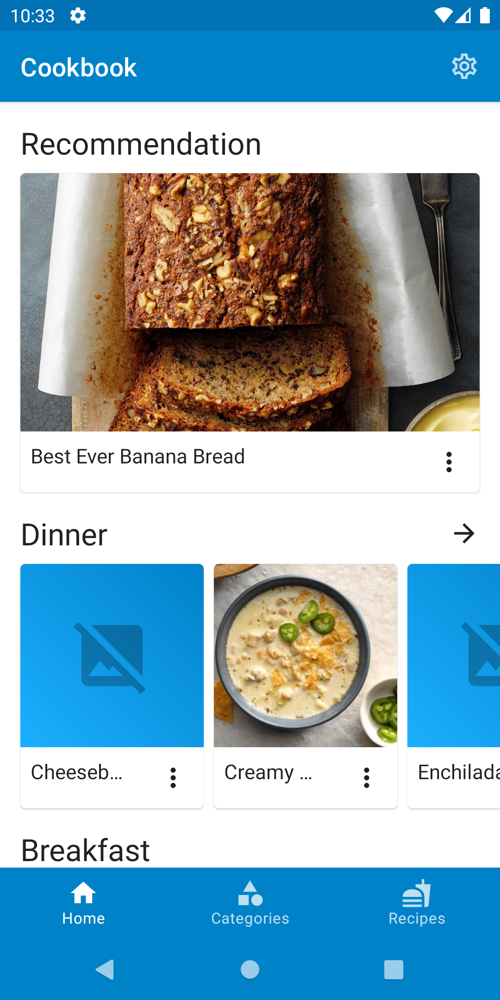
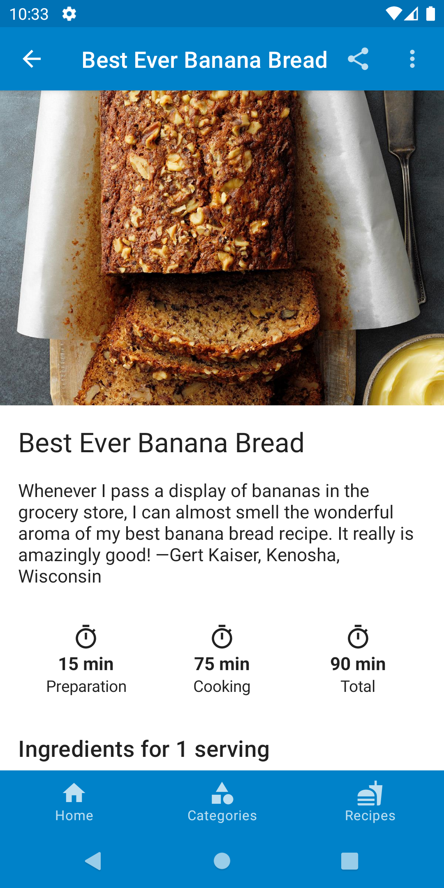

# Nextcloud Cookbook Android client

An Android client for [Nextcloud Cookbook app](https://github.com/nextcloud/cookbook).

## Download

## Screenshots
<table>
    <tr>
        <td></td>
        <td></td>
        <td></td>
        <td></td>
    </tr>
</table>

## Features :rocket:

- List all recipes
- List all recipes by category
- Create recipe
- View recipe
- Edit recipe
- Stay awake on recipe screen
- Settings

## Planned features :checkered_flag:

- Offline usage
- Single Sign On through Nextcloud Files app
- Login via QR-Code
- Import recipe via url

## Requirements :link:

* [Nextcloud](https://nextcloud.com/) instance running
* [Nextcloud Cookbook](https://github.com/nextcloud/cookbook) app enabled

## Build the app :hammer_and_wrench:

1. Open project in Android Studio
2. Run the app

## Contributing

- [Bugfix](https://github.com/lneugebauer/nextcloud-cookbook/blob/main/docs/contributing.md#bugfix)
- [Feature](https://github.com/lneugebauer/nextcloud-cookbook/blob/main/docs/contributing.md#featuresimprovements)
- [Translations](https://github.com/lneugebauer/nextcloud-cookbook/blob/main/docs/contributing.md#translations)

### Translations :earth_africa:

## License

[MIT License](https://github.com/lneugebauer/nextcloud-cookbook/blob/main/LICENSE)
