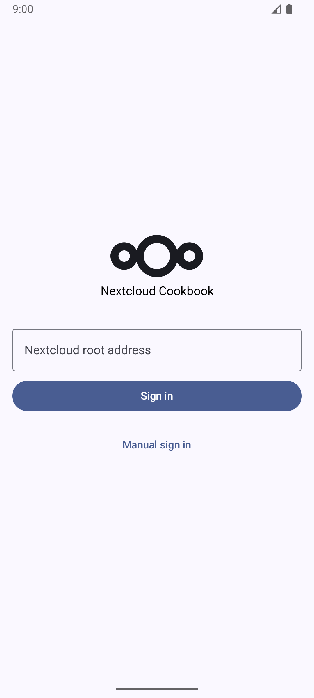
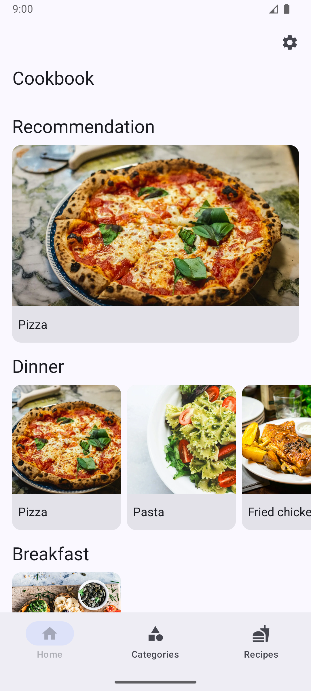
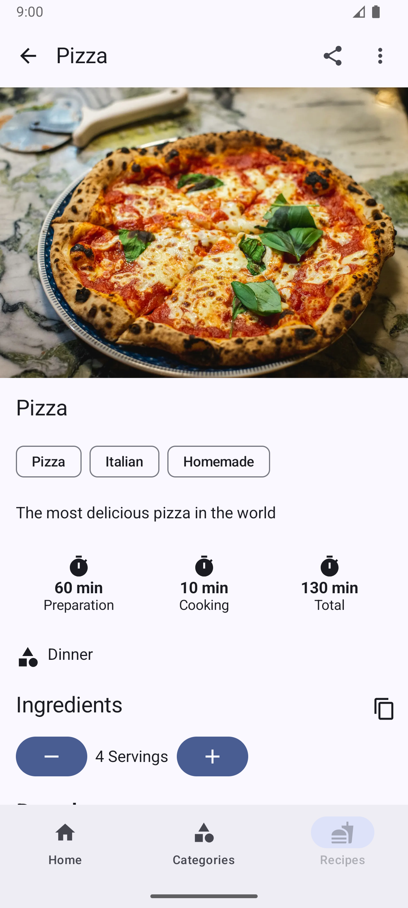
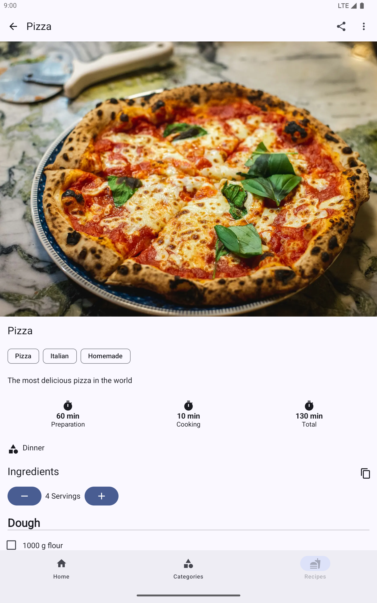

# Nextcloud Cookbook Android client

An Android client for [Nextcloud Cookbook app](https://github.com/nextcloud/cookbook).

## Download

### Obtainium

To install through [Obtainium](https://github.com/ImranR98/Obtainium/tree/main?tab=readme-ov-file#installation), simply go to Add App and paste the URL of this repository as the source URL: `https://github.com/lneugebauer/nextcloud-cookbook`.

## Screenshots
<table>
    <tr>
        <td>Phone</td>
        <td></td>
        <td></td>
        <td></td>
        <td></td>
    </tr>
    <tr>
        <td>Tablet</td>
        <td></td>
        <td></td>
        <td></td>
        <td></td>
    </tr>
</table>

*Photo by [Eaters Collective](https://unsplash.com/@eaterscollective?utm_content=creditCopyText&utm_medium=referral&utm_source=unsplash) on [Unsplash](https://unsplash.com/photos/pesto-pasta-with-sliced-tomatoes-served-on-white-ceramic-plate-12eHC6FxPyg?utm_content=creditCopyText&utm_medium=referral&utm_source=unsplash)*  
*Photo by [Ella Olsson](https://unsplash.com/@ellaolsson?utm_content=creditCopyText&utm_medium=referral&utm_source=unsplash) on [Unsplash](https://unsplash.com/photos/assorted-fruits-and-vegetable-on-brown-wooden-chopping-board-2IxTgsgFi-s?utm_content=creditCopyText&utm_medium=referral&utm_source=unsplash)*  
*Photo by [Aurélien Lemasson-Théobald](https://unsplash.com/@aurel__lens?utm_content=creditCopyText&utm_medium=referral&utm_source=unsplash) on [Unsplash](https://unsplash.com/photos/round-cooked-pizza-x00CzBt4Dfk?utm_content=creditCopyText&utm_medium=referral&utm_source=unsplash)*

## Features :rocket:

- List all recipes
- List all recipes by category
- Create recipe
- View recipe
- Edit recipe
- Stay awake on recipe screen
- Settings
- Import recipe via url

## Planned features :checkered_flag:

- Offline usage
- Single Sign On through Nextcloud Files app
- Login via QR-Code

## Requirements :link:

* [Nextcloud](https://nextcloud.com/) instance running
* [Nextcloud Cookbook](https://github.com/nextcloud/cookbook) app enabled

## Build the app :hammer_and_wrench:

1. Open project in Android Studio
2. Run the app

## Contributing :office_worker:

- [Bugfix](https://github.com/lneugebauer/nextcloud-cookbook/blob/main/docs/contributing.md#bugfix)
- [Feature](https://github.com/lneugebauer/nextcloud-cookbook/blob/main/docs/contributing.md#featuresimprovements)
- [Translations](https://github.com/lneugebauer/nextcloud-cookbook/blob/main/docs/contributing.md#translations)

### Translations :earth_africa:

## License

[MIT License](https://github.com/lneugebauer/nextcloud-cookbook/blob/main/LICENSE)
